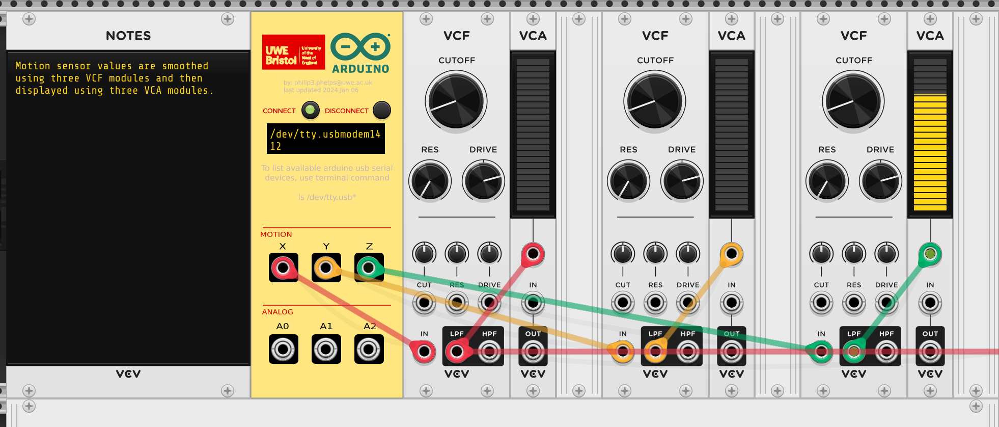
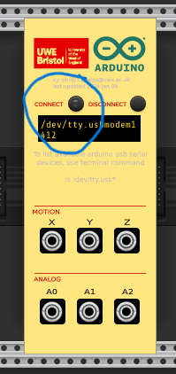

# Workshop 4 - Fun with Physical Computing, Interaction Design, and VCV Rack! 

   

Hello everyone! 

In this workshop we will be patching and controlling VCV Rack modules, however this time using tools and hardware that you have built with your hands. Using the components and tools that we provide, the controls for soft-synths are transported "off the screen and into the world"! (The workshop assumes you have _some_ familiarity with using VCV Rack, but please chat to us if you are unsure).

After some initial set up, you will be guided to explore the relationship between physical inputs and sound outputs, a core part of the music technology industry (and many others!) called Interaction Design.

# Part 1 - Getting Started

 
Click here for instructions!

## In this section, we will download all the files we need and build our VCV Rack project:
 
|Instructions                                                                                                    |Images                                                                                                                             |  
| :--------------------------------------------------------------------------------------------------------------| :-------------------------------------------------------------------------------------------------------------------------------: |
| 1. Download and open the supplied XCode project                                                                | .                            |
| 2. When prompted, 'Trust and Open' the project                                                                 | .                                                                   |
| 3. Use the XCode ‘Play’ button to build your project and await success. **VCV Rack will open automatically**   |        |

# Part 2 - Moving into VCV Rack

 
Click here for instructions!

 ## In this section, we will open up VCV Rack and make sure our custom UWE VCV Rack Module is installed:
 
| Instructions                                                                                                                          | Images                                      |
| :------------------------------------------------------------------------------------------------------------------------------------ | :-----------------------------------------: |
| 1. Right Click in VCV Rack and open up the Modules Library                                                                            |         |
| 2. Check the UWE VCV Module is there (It's the bright yellow and red one with the UWE Logo at the top!)                               |       |
| 3. Open the VCV Rack Starter Patch we have provided. It's called 'VCV-starter.vcvrack. Once opened, it should look like this:         |  |

# Part 3 - Setting up the Arduino

 
Click here for instructions!

## **Make sure to pay extra attention to detail in this section!** Here, we will set up our Arduino to work with VCV Rack and our UWE VCV Rack Module:
 
| Instructions                                                                                                                                                                                                         | Images                                        |
| :--------------------------------------------------------------------------------------------------------------------------------------------------------------------------------------------------------------------| :-------------------------------------------: |
| 1. Look at the UWE Module in VCV Rack. Press the CONNECT button on the UWE module **after** plugging in the Arduino.                                                                                                 |           |
| 2. This might not work first time. If it doesn't connect, we have provided a tool to help find the USB name. The tool is called 'arduino_usb_helper' and will find the name of USB Devices attached to your machine. |  |
| 3. Similarly to XCode, you can run the tool we have created using the Play button:                                                                                                                                   |     |
| 4. If your Arduino is not connected correctly, you will see this message. Check the device is correctly connected or speak to a member of staff:                                                                     |       |
| 5. If your Arduino is connected correctly, you will see this message. Copy the numbers and return to the UWE VCV Rack Module:                                                                                        |             |
| 6. Change the text in the UWE VCV Module to match the numbers you have copied and try to connect again.                                                                                                              |                                               |

# Part 4 - Setup finished... let's make some noise!

 
Click here for instructions!

 
## Exercise 1 - Playful Exploration
In this part of the workshop, we want you to help you focus on developing meaningful, intuitive relationships between physical inputs and sound outputs. The Arduino hardware we’re using has a built-in motion sensor and is ready to go. 

Q: what happens when you pick up the hardware and move it around gently? 
The motion outputs on our module should respond to three axis of movement. 

Q: What happens when you tilt the hardware in different directions? 

Q: Can you work out which physical movements refer to which axis (x,y,z)?  

Hint: try a back-and-forth action, followed by up-and-down, then side-to-side 

Q: Can you work out how to tune the frequency to play a little melody? 

## Exercise 2 - Thinking about Interaction Design
Q: Which motion feels more intuitive for pitch control – up-and-down or side-to-side? 

Q: What sound parameters beyond oscillator pitch could we alter? Filter resonance? 

Q: What sound parameters feel intuitive or natural to control with a key-turning motion? 

There is an art to finding meaningful, intuitive relationships between physical inputs and sound outputs. This practice is called INTERACTION DESIGN, and it is a core part of the music technology industry.  

Creative tools and Digital Musical Interfaces that are frustrating or confusing to interact with are arguably badly designed and difficult to work with. Of course, intentionally unpleasant experiences are just as valid as pleasant ones, but let’s try to have fun! 😀 

## Exercise 3 - Sliders
The word haptic refers to the sensation and act of touching.  A very common music technology control mechanism is the SLIDER. These are great for controlling sound with “set and forget” behaviour, but also for reacting to expressive and articulate movements. 

## Exercise 4 - Distance Sensors
Okay now for something different! Rather than moving the hardware around... 

Let’s now connect a sensor to detect the motion of our hands in proximity to the sensor. 

... more images and guidance here... 

Pick the sensor out and take a closer look. It emits a beam of infrared light whilst measuring the intensity of light bounced back into the photosensor. If you stare at the sensor (when it’s on), you can see a faint gloaw as some of the emitted light falls into the visible-light spectrum. 

Some sensors have a cable connected with red (POWER), black (GROUND) and yellow (SIGNAL) connectors. Some sensors have red (POWER), black (GROUND) and white (SIGNAL) connectors. Connect the sensor in place of the slider and observe the value as you move your hand over the sensor. 

Because the sensor detects the intensity of its reflected IR light, the sensor outputs near-zero when nothing is in front of it (approx. > 3ft), and ramps up as an object comes near, when the object is very close the value starts to drop off again. 

## Exercise 5 - Lights
Let’s build a Light Dependent Resistor circuit on the breadboard to use with your smartphone flashlight 😀🔦💡 

